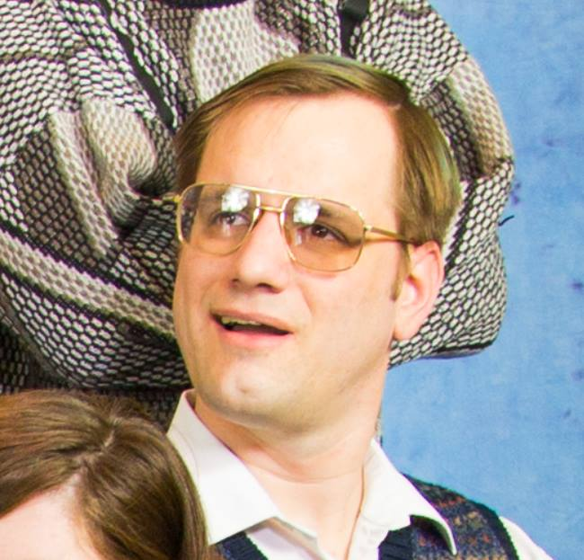
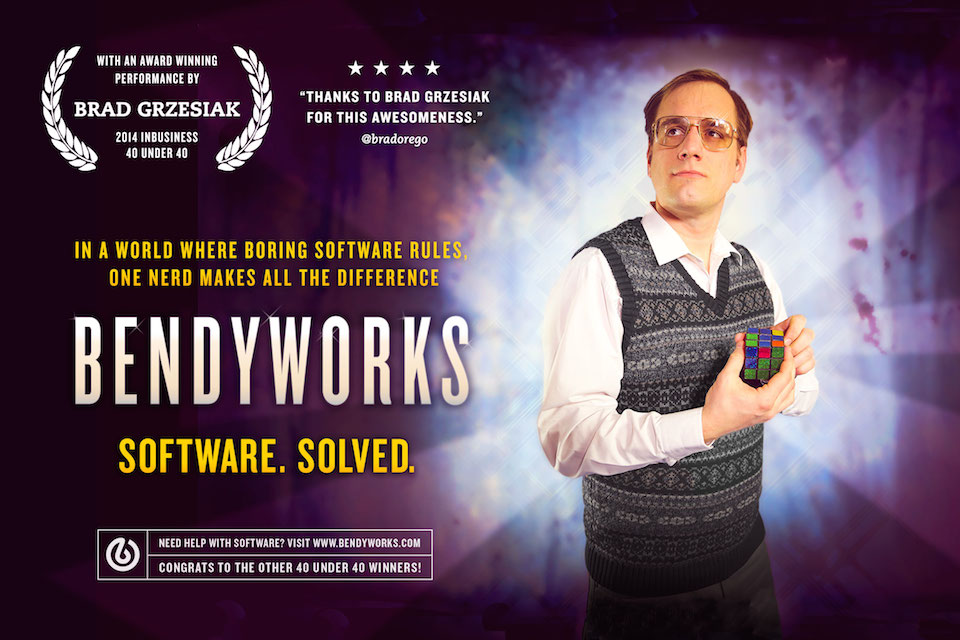

!SLIDE
# The Secrets to True Programming Happiness #
## by bradley grzesiak ##

!SLIDE
# who is this guy? #

!SLIDE center

!SLIDE center

!SLIDE center

!SLIDE incremental bullets
# UW Grad #

* computer sciences BS '05
* engineering mechanics & astronautics BS '05
* engineering mechanics & astronautics MS '0...

!SLIDE
# 5 years #
## orbital technologies ##
## aerospace engineer ##

!SLIDE
# 5 years #
## nothing ever sent to space ##
## :( ##

!SLIDE
# SO! #

!SLIDE
# Bendyworks #
## 5 years #

!SLIDE
# Bendyworks #
## ruby on rails, js, iOS & clojure ##

!SLIDE
# Madisonium #
## elevate web tech scene in madison ##

!SLIDE
# Digital Technology Committee #
## advises Madison's Common Council ##

!SLIDE bullets
# That's Me #
* uw grad
* former aerospace engineer
* current bendyworks co-founder
* chair of madisonium
* madison appointed official
* @listrophy
