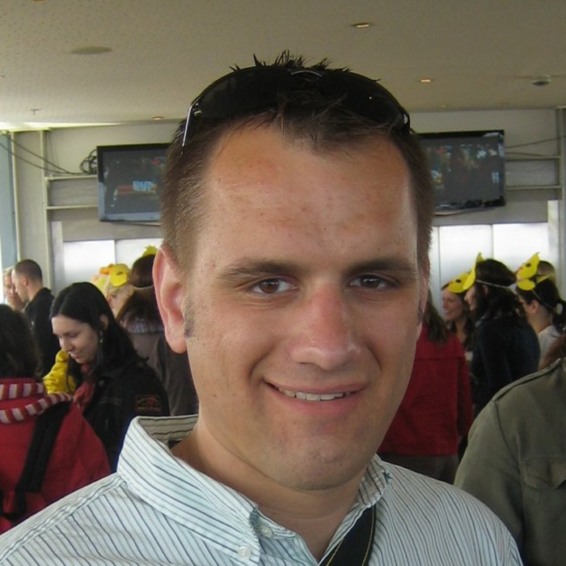
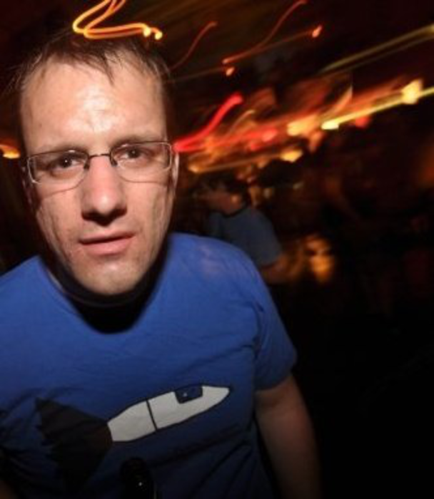
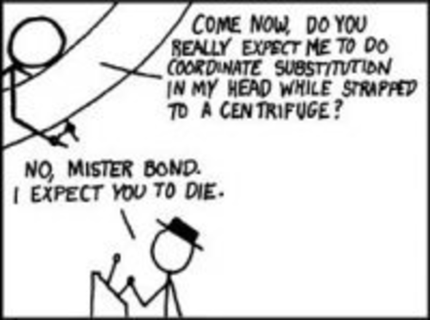

!SLIDE
# The Secrets to True Programming Happiness #
## by bradley grzesiak ##

!SLIDE
# who is this guy? #

!SLIDE center

!SLIDE center

!SLIDE center

!SLIDE center

!SLIDE

# UW Grad #

## computer sciences BS '05 ##
## engineering mechanics & astronautics BS '05 ##
## engineering mechanics & astronautics MS '0... ##

!SLIDE

# 5 years #
## Orbital Technologies ##
## Aerospace Engineer ##

!SLIDE

# 5 years #
## nothing ever sent to space ##
## :( ##

!SLIDE

# SO! #

!SLIDE

# Bendyworks #
## almost 3 years #

!SLIDE

# Bendyworks #
## ruby on rails & iOS ##

!SLIDE bullets
# That's Me #
* UW Grad
* Former Aerospace Engineer
* Current Bendyworks co-founder
* @listrophy
